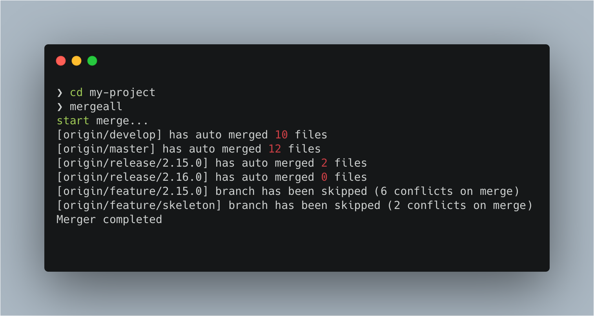

# mergeall
能自动将 master 分支代码合并到其余所有分支并提交到远端的工具
## Installation

```bash
npm install @lilywang711/mergeall -g
```

## Usage

命令行进入某个项目目录，执行 `mergeall` 即可

效果如下



## Contributing

- Fork it!
- Create your feature branch: `git checkout -b my-new-feature`
- Commit your changes: `git commit -am 'Add some feature'`
- Push to the branch: `git push origin my-new-feature`
- Submit a pull request

## License
[MIT](https://choosealicense.com/licenses/mit/)

