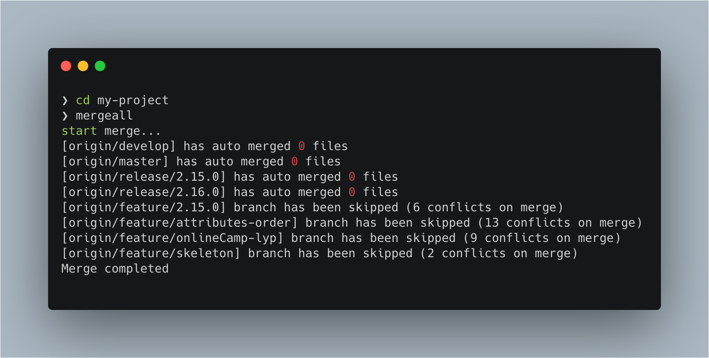

# mergeall
A tool that automatically merges master branch code to all remaining branches and commits it to the remote
## Installation

```bash
npm install @lilywang/mergeall -g
```

## Usage

Go to a project directory and execute `mergeall` from the command line




Note: conflicting branches will be skipped.

## Contributing

- Fork it!
- Create your feature branch: `git checkout -b my-new-feature`
- Commit your changes: `git commit -am 'feature: Add some feature'`
- Push to the branch: `git push origin my-new-feature`
- Submit a pull request

## License
[MIT](https://choosealicense.com/licenses/mit/)

